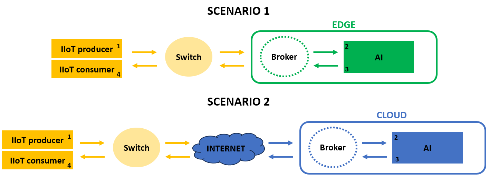

## PROJECT OVERVIEW

This project tests different protocols (AMQP, MQTT, ZEROMQ, KAFKA and OPCUA) simulating high frequency data under 2 different scenarios: edge and cloud. The data flow is the following:

* Scenario 1- IIOT sends data to the edge, it is received by the AI consumer, and it is sent back to the IIOT.

* Scenario 2- IIOT sends data to the cloud, it is received by the AI consumer, and it is sent back to the IIOT.

- 4 timestamps are measured:
  1. **T1:** timestamp when data packet exits IIOT simulator service
  2. **T2:** timestamp when data packet arrives AI simulator service
  3. **T3:** timestamp when data packet exits AI simulator service
  4. **T4:** timestamp when data packet arrives IIOT simulator service

** Sent data packet are composed by int32 type lists. Performed experiments send data packets at different packet rates ([10,20,40] packets/s) and list lentgths, performin 1,4 and 8 Mbytes/s throughput experiments.

## FOR LAUNCHING THE PROJECT AND GET OWN RESULTS:
  1. IIOT parameters configuration: in the file *produce/producer/app/config.py*: configure edge and cloud server IPs (*cloud_server*, *edge_server* values)
  2. AI parameters configuration: in the file *produce/suscriber/app/config.py*: configure edge and cloud server IPs (*cloud_server*, *edge_server* values)
  3. *docker-compose-Final.yml* configuration: in the *produce/docker-compose-Final.yml*: configure the producer and suscriber services environmental variables:
      - **PROTOCOL:** The wanted protocol to be tested
      - **CYCLES:** The length in seconds of each experiment
      - **SAMPLING_FREQ** and **LIST_LEN:** The wanted combination of data packet rate and length to test (the lists are related one by one)
      - **RUNS:** List with the start and end iterations of the experiments, ex: [1:10], it will perform 10 times the experiments.
      - **BROKER:** whether edge or cloud scenario.
      - **NUMBER_OF_COMBINATIONS:** number of SAMPLING_FREQ and LIST_LEN combinations (=the length of one of the lists)

  4. docker-compose file selection in AI service: select the corresponfing .yml in consume/ folder depending the protocol to be tested. configure the consumer service environmental variables:
    - **BROKER:** whether edge or cloud scenario
    - **NUMBER_OF_COMBINATIONS:** number of SAMPLING_FREQ and LIST_LEN combinations (=the length of one of the lists)
    * If kafka is being tested: in *KAFKA_ADVERTISED_LISTENERS* environmental variable, *set MI_PC_VICOM_HOST://{IP_EDGE_SERVER}:29092*, *AWS_HOST://{IP_CLOUD_SERVER}:29093*
  
  5. Launch the docker-compose file of the *consume/* folder in the edge/cloud server
  6. Launch the docker-compose file of the *produce/* folder in the IIOT simulator server
  7. As much as iterations configured at *RUNS* environmental variable of *produce/docker-compose-Final.yml* are performed. Results are saved as following:
      - In the *produce/results*, one folder is created for each of the performed RUNS, ex: *results_RUN{RUN_number}_{edge or cloud scenario}*. Inside each of theese folders, 3 different files are created associated to each experiment (each *protocol/LIST_LEN/SAMPLING_FREQ* combination): 
        - **metadata_{protocol}_{experiment_number}.txt:** file containing the metadata of the experiment, with:  protocol, data type, data packet length, data packet rate, number of cycles of the experiment.
        - **send_{protocol}_{experiment_number}.csv:** csv containing all the T1 timestamps of the experiment, with: ID (id of each individual data packet in the experiment), TIME1 (T1 timestamp), location (IIOT host), metadata_id (id associated to the experiment)
        - **receive_{protocol}_{experiment_number}.csv:** csv containing all the T4 timestamps of the experiment, with: ID (id of each individual data packet in the experiment), TIME4 (T4 timestamp), SCRIPT_TIME (processing time of the IIOT receive script, it must be substracted later for measuring the real latency and jitter of the protocol), location (IIOT host), metadata_id (id associated to the experiment)

      - In the *consume/results*, one folder is created for each of the performed iteration, ex: *results_RUN{RUN_number}_{edge or cloud scenario}*. Inside each of theese folders, 2 different files are created associated to each experiment (each *protocol/LIST_LEN/SAMPLING_FREQ* combination): 
        - **process_receive_{protocol}_{experiment_number}.csv:** csv containing all the T2 timestamps of the experiment, with: ID (id of each individual data packet in the experiment), TIME2 (T2 timestamp), location (AI host), metadata_id (id associated to the experiment)
        - **process_send_{protocol}_{experiment_number}.csv:** csv containing all the T3 timestamps of the experiment, with: ID (id of each individual data packet in the experiment), TIME3 (T3 timestamp), SCRIPT_TIME (processing time of the AI service script, it must be substracted later for measuring the real latency and jitter of the protocol), location (AI host), metadata_id (id associated to the experiment)
  8. Compose down the lanuched *docker-compose.yml* files, and repeat the process selecting another different protocol.

## FOR DOWNLOADING RESULTS:
- **Name of the dataset:**
    IIOT protocols study for high frequency data in the edge and cloud

- **Description:**
    The provided data is the following:
    1. *EXPERIMENTS RAW DATA:*
        * Data inside *produce/results* and *consume/results* folders contain raw information about the performed experiments.
            - Inside *produce/results* there are 45 numbered folders containing *edge* experiments and 45 numbered folders containin *cloud* experiments, each of them corresponding to 1 iteration. One folder is created for each of the iterations, example: *results_RUN{iteration_number}_{edge or cloud scenario}*. Inside each of theese folders, 3 different files are created associated to each *protocol/data_packet_length/data_packet_rate* combination. There are 9 possible combitations, with the following parameters: data_packet_rate: "[10, 20, 40, 10, 20, 40, 10, 20, 40]", data_packet_length: "[25000, 12500, 6250, 100000, 50000, 25000, 200000, 100000, 50000]" 
                - **metadata_{protocol}_{experiment_number}.txt:** file containing the metadata of the experiment, with:  protocol, data type, data packet length, data packet rate, number of cycles of the experiment.
                - **send_{protocol}_{experiment_number}.csv:** csv containing all the T1 timestamps of the experiment, with: ID (id of each individual data packet in the experiment), TIME1 (T1 timestamp), location (IIOT host), metadata_id (id associated to the experiment)
                - **receive_{protocol}_{experiment_number}.csv:** csv containing all the T4 timestamps of the experiment, with: ID (id of each individual data packet in the experiment), TIME4 (T4 timestamp), SCRIPT_TIME (processing time of the IIOT receive script, it must be substracted later for measuring the real latency and jitter of the protocol), location (IIOT host), metadata_id (id associated to the experiment)

        * Data inside *consume/results* and *consume/results* folders contain raw information about the performed experiments.
            - Inside *produce/results* there are 45 numbered folders containing *edge* experiments and 45 numbered folders containin *cloud* experiments. As the experiments has been performed 45 times, each of the folder contains the same files corresponding to different iterations. One folder is created for each of the performed experiments, ex: *results_RUN{id of the experiment}_{edge or cloud scenario}*. Inside each of theese folders, 2 different files are created associated to each *protocol/data_packet_length/data_packet_rate* combination: 
                - **process_receive_{protocol}_{experiment_number}.csv:** csv containing all the T2 timestamps of the experiment, with: ID (id of each individual data packet in the experiment), TIME2 (T2 timestamp), location (AI host), metadata_id (id associated to the experiment)
                - **process_send_{protocol}_{experiment_number}.csv:** csv containing all the T3 timestamps of the experiment, with: ID (id of each individual data packet in the experiment), TIME3 (T3 timestamp), SCRIPT_TIME (processing time of the AI service script, it must be substracted later for measuring the real latency and jitter of the protocol), location (AI host), metadata_id (id associated to the experiment)

    2. *EXPERIMENTS PROCESSED DATA:*
        * *experimental_results/* folder contains processed edge and cloud experiment .csv files.
            * *experimental_results/{edge or cloud}* folder contains 45 .csv numbered files with the following name structure *{edge or cloud}_experiments_RUN{iteration_number}.csv*. Each of them contain the following extracted metrics and metadata over the raw .csv files: 
                - Metrics: mean latency, latency_stdev, mean jitter, jitter_stdev lost_packages, not_ordered_packages.
                - Metadata:	protocol (employed protocol), data_type (data type employed in the experiments), list_length (data packet size), sampl_freq (data packet rate), cycles (duration of the experiment), Mbytes/Sec (experiment troughput), Payload(Kbytes) (data packet payload).
            * *experimental_results/{edge or cloud}/{edge or cloud}_experiments.csv*: This file contains the mean of all the *{edge or cloud}_experiments_RUN{id}.csv* individual experiment iterations grouped by same *protocol/data_packet_length/data_packet_rate* combination. This file is employed for visualizing the results. For visualizing them, please refer to *https://github.com/telmobarrena98/Protocols_tester/2-Result_Visualizer_edgeORcloud.py*.
        
            

- **Link to download the dataset:**
https://opendatasets.vicomtech.org/di13-iiot-protocols-study-for-high-frequency-data-edge-cloud/9294245f

- **Authors:**
Telmo Fernández De Barrena, Ander García and Juan Luis Ferrando

- **Contact:** 
tfernandez@vicomtech.org

- **Usage License:** 
This agreement grants the Recipient a non-exclusive, non-transferable license to access and use the *IIOT protocols high frequency data  edge and cloud experiments* dataset for internal research and analysis purposes only. Recipient may not distribute, sell, or modify the Dataset without prior written consent from Vicomtech. Recipient agrees to maintain the confidentiality of the Dataset. All intellectual property rights remain with Vicomtech.

## FOR VISUALIZING THE RESULTS:
  1. Put the *produce/results* and *consume/results* in the same PC, in their respective folders.
  2. Run the *1-Create_Results.py* file, indicating the number of iterations that have been performed (*runs* variable") and the scenario (*broker* variable, values: edge or cloud). This script takes all the experiments one by one, and calcuates mean latency, latency_stdev, mean jitter, jitter_stdev, lost_packages, not_ordered_packages, packet payload(Kbytes) metrics of each experiment, creating *{edge or cloud}_experiments_RUN{experiment_RUN}.csv* files. Moreover, it creates *{edge or cloud}_experiments.csv* file, being the mean of all the *{edge or cloud}_experiments_RUN{experiment_RUN}.csv* individual experiments grouped by same *protocol/data_packet_length/data_packet_rate* combination. This last .csv will be used for visualizing the results. This results are save in *experimental_results/{edge or cloud}* folder.
  3. Run *Result_Visualizer_edgeORcloud.py* file, indicating the scenario (*broker* variable, values: edge or cloud). This script saves plots employing the previously extracted metrics in in *experimental_results/{edge or cloud}/all_combinations* folder. It groups the plots by same througput.

